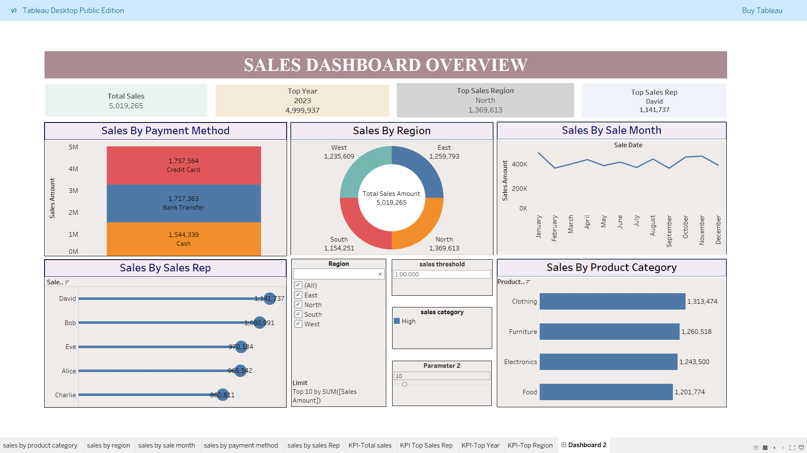

# Sales Dashboard Overview

This project presents a Sales Dashboard built using Tableau to visualize and analyze key business metrics. The dashboard offers an interactive view of sales performance across various categories, regions, and time periods.

## Features:
- Total Sales, Profit, and Quantity KPIs  
- Sales by Category and Sub-Category  
- Monthly Sales Trend  
- Regional Sales Distribution  
- Top-performing Products  

## Tool Used:
- Tableau  

## Objective:
To help stakeholders understand sales trends, identify top-selling products, and make data-driven business decisions.

